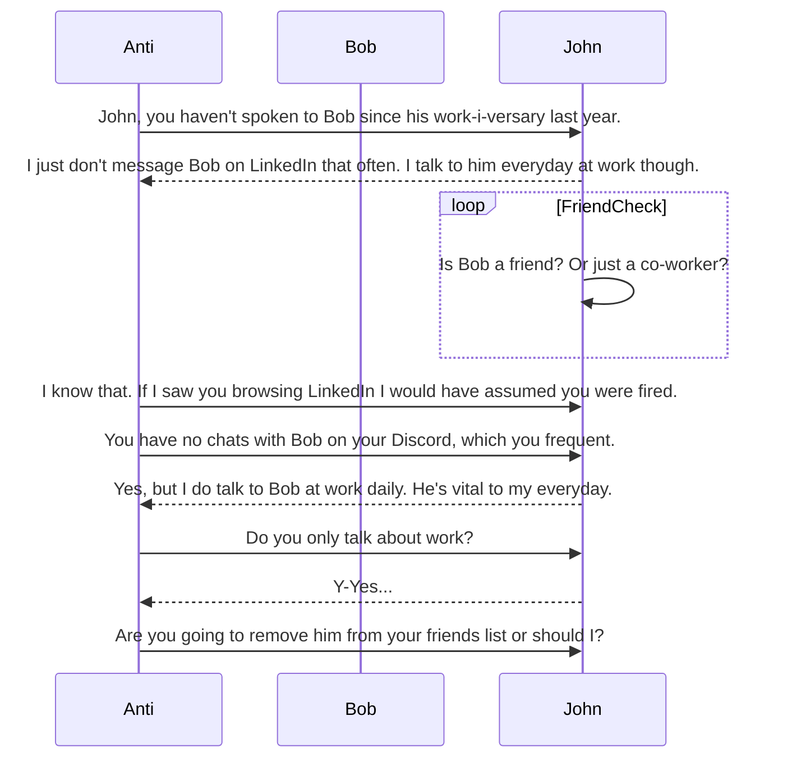

# antisocial
A (parody) social media site built around being the opposite of a social media site (anti-social). Instead of encouraging following and connecting with more people, the site encourages you to dis-associate with people through recommendations (you haven't DM'd this person in awhile, perhaps you should drop them from your friends list).

## Design
[Design doc](/docs/Design.md)
