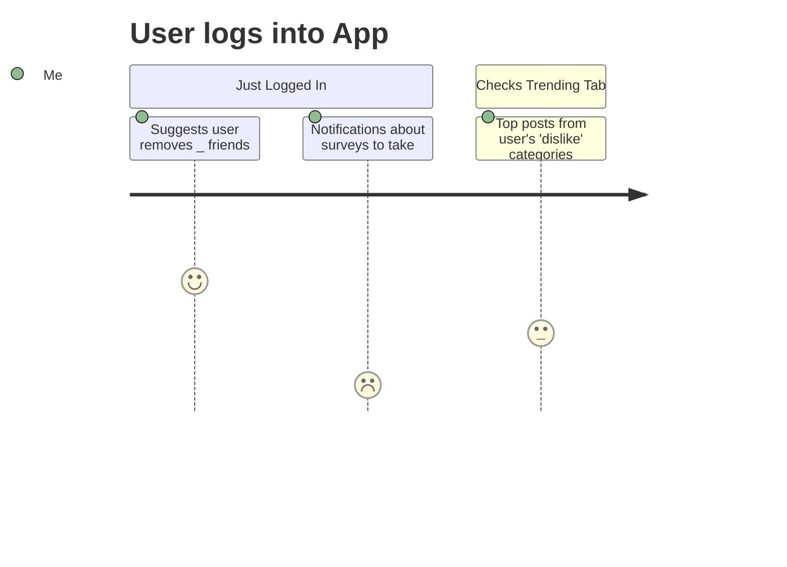
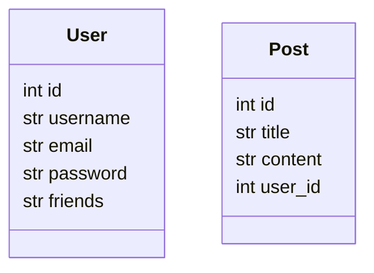
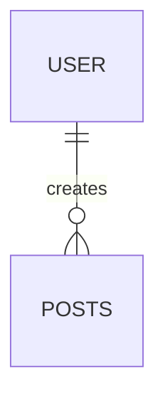
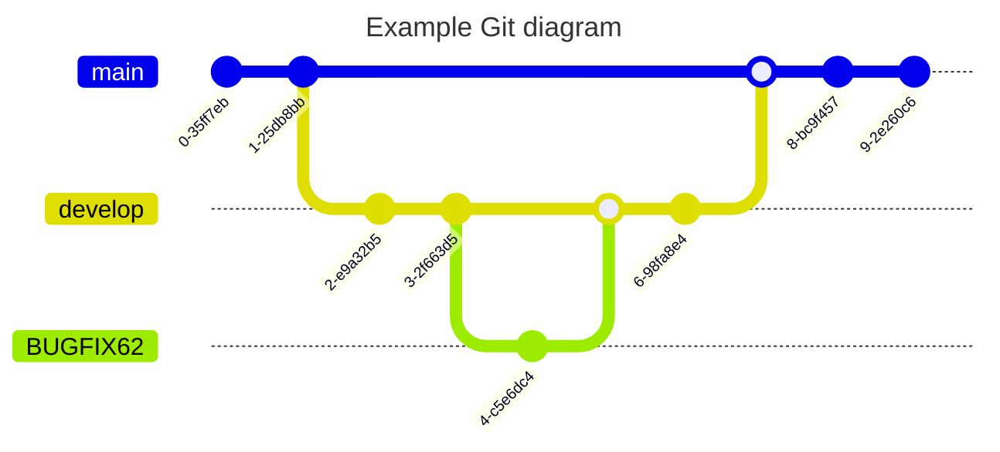

- [ideas](#ideas)
- [Example App usage Diagram](#example-app-usage-diagram)
- [DB Diagrams](#db-diagrams)
  - [Tables](#tables)
  - [Entity Relationship Diagram](#entity-relationship-diagram)
- [Development Process](#development-process)
  - [Branching](#branching)
  - [Categories](#categories)

## ideas
* instead of encouraging following and connecting with more people, the site encourages you to dis-associate with people through recommendations (you haven't DM'd this person in awhile, perhaps you should drop them from your friends list).
* Categories: Stranger, Acquaintance, Friend
* The site encourages continuous building of the close relationships you already have (you haven't played Minecraft with Drake in a while, perhaps you should join his server for 2 hours)
* There's a main public board for everyone to post whatever, but instead of their usernames everyone you don't know is called 'Stranger'. And there's a red warning label under or above their content: "Stranger Danger: Can you really trust what this person is saying?"
* The site also alerts you to when your friends have reported having a bad or off day: "Sally has reported feeling 10% sadder this week. Perhaps take her out for coffee for some 1 on 1 decompress time"
* Of course the above means quizzes/questions are given at certain intervals. 
* Apparently the site recommends very specific actions based on the friendship/person
* Extra: Have the site be able to follow your friends around the interwebs: see Drake's steam activity, Sally's Facebook usage time, Darren's Discord activity, Raru's LinkedIn work status 
* Monetization: allow users to either pay for the service monthly, or choose what data is collected on them for ads: "Choose the following data collection examples you are ok with me using to send you customized ads and pay for your use on the platform. You have to choose enough to satisfy this number value. I'll let you know when it reaches zero."

## Example App usage Diagram

## DB Diagrams
### Tables

### Entity Relationship Diagram 

## Development Process
1. Create an Issue
2. Create a new branch with the issue# and category (clone from develop) : BUGFIX62
3. Create PR to merge into develop
4. Create PR to merge to main once features are confirmed (Github action will push to prod automatically on merge)

### Branching 

### Categories 
* BUGFIX 
* FEAT - new feature
* DOCS 
* REFACT - refactoring. For use if bugfix does not apply.
